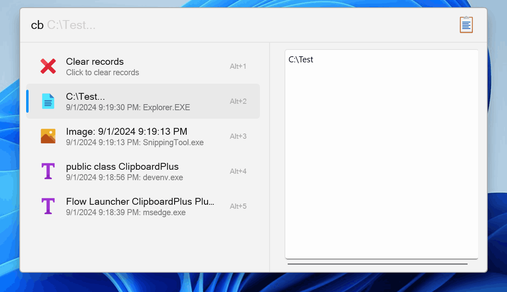
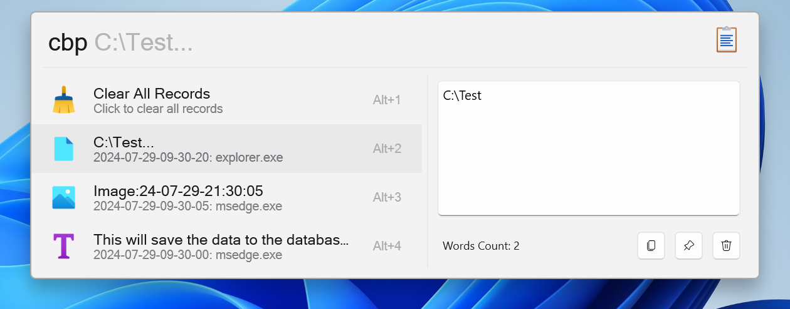
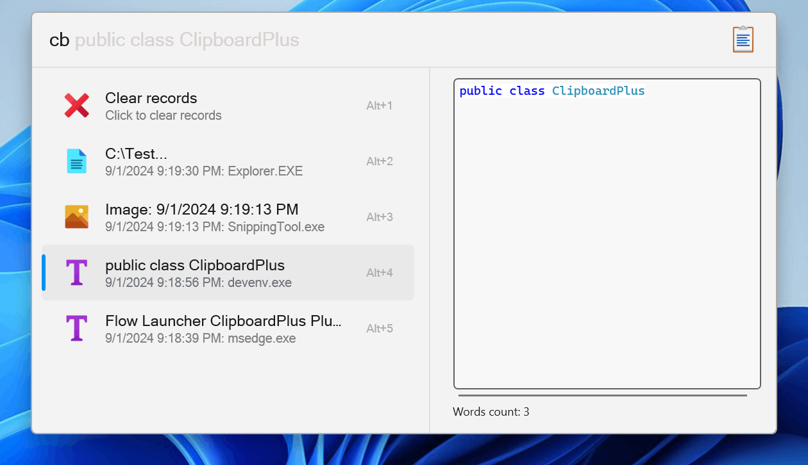
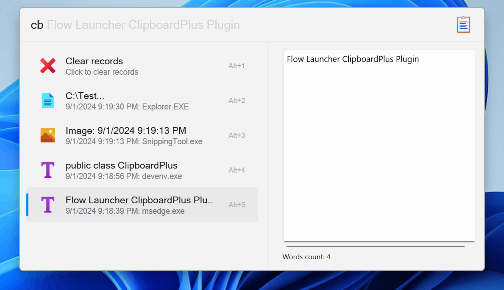
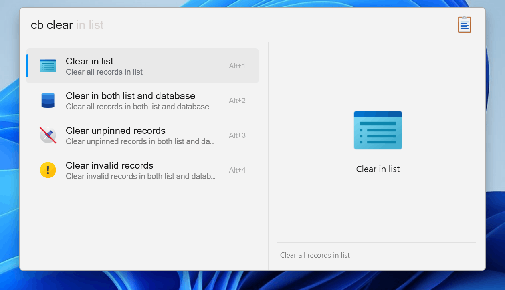
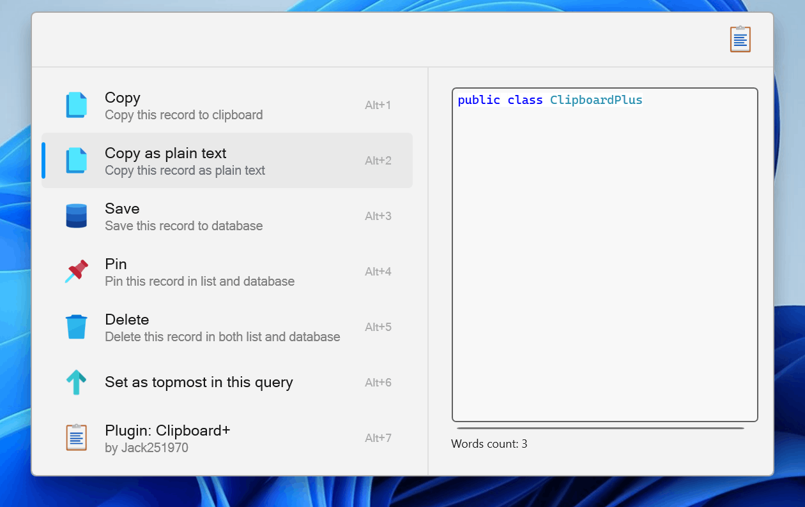

# Flow Launcher ClipboardPlus Plugin

## About

This plugin is a clipboard manager for [Flow Launcher](https://github.com/Flow-Launcher/Flow.Launcher).

It can help you manage your clipboard history and customizing copy rules with support for text, images, and files.

## Features

- Copy & delete & pin record
- Cache images to folder
- Manage records in list and database
- Preview panel for text, images, and files
- Persistent keep records in database
- Words count for text
- Customize copy rules

## Screenshots

## Installation

### Manually Build

1. Clone the repository
2. Run `build.ps1` or `build.sh` to publish the plugin in `.dist` folder
3. Unzip the release zip file
4. Place the released contents in your `%appdata%/FlowLauncher/Plugins` folder and **restart** Flow Launcher

### Manually Release

1. Downlaod zip file from [Release](https://github.com/Jack251970/Flow.Launcher.Plugin.ClipboardPlus/releases)
2. Unzip the release zip file
3. Place the released contents in your `%appdata%/FlowLauncher/Plugins` folder and **restart** Flow Launcher

### Plugin Store

1. Search `Clipboard+` in Flow Launcher Plugin Store and install

## Usage

The default action keyword is `cbp`, you can change it in the FlowLauncher.

Click `Copy` or directly the `search result` to copy the current data to clipboard, click `Delete` to delete the record.

If you want to save images in your clipboard, open the `CacheImages` option in settings.

This will automatically save the images to the cache folder, and you can view them in the folder `Plugin Dictionary/CachedImages`.

If you want to keep the text, images or files in the database, open the `KeepText`, `KeepImage` or `KeepFile` option in settings.

This will save the data to the database, and you won't lose them when you exit the Flow Launcher.

> Note: It is recommended to cache images using `CacheImages` option, 
saving large images via `KeepImage` to database may block query for a little while.

## Reference

- [ICONS](https://icons8.com/icons)
- [ClipboardR](https://github.com/rainyl/Flow.Launcher.Plugin.ClipboardR)
- [SharpClipboard](https://github.com/Willy-Kimura/SharpClipboard)

## License

[Apache License V2.0](LICENSE)
