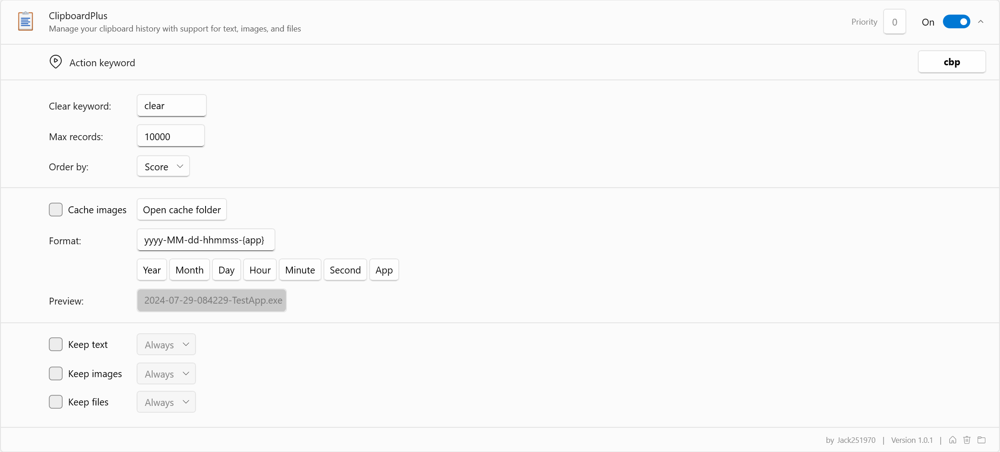

# Flow Launcher ClipboardPlus Plugin

## About

This plugin is a clipboard manager for [Flow.Launcher](https://github.com/Flow-Launcher/Flow.Launcher).

It can help you manage your clipboard history with support for text, images, and files.

## Features

- Preview panel, support images
- Copy & delete & pin record
- Cache images supported
- Manually save images
- Persistent & Keep time settings
- Clear records in list or database
- Words count

## Installation

### Manually Build

1. Clone the repository
2. Run `build.ps1` or `build.sh` to publish the plugin in `.dist` folder
3. Unzip the release zip file
4. Place the released contents in your `%appdata%/FlowLauncher/Plugins` folder and **restart** FlowLauncher

### Manually Release

1. Downlaod zip file from [Release](https://github.com/Jack251970/Flow.Launcher.Plugin.ClipboardPlus/releases)
2. Unzip the release zip file
3. Place the released contents in your `%appdata%/FlowLauncher/Plugins` folder and **restart** FlowLauncher

### Plugin Store

Sorry, the plugin store is not available yet.

## Usage

The default keyword is `cbp`, you can change it in the FlowLauncher.

Click `Copy` or directly the `search result` to copy the current data to clipboard, click `Delete` to delete the record.

If you want to save images in your clipboard, open the `CacheImages` option in settings.

Note: It is recommended to cache images using `CacheImages` option, 
saving large images via `KeepImage` to database may block query for a little while.

## Todo

- [ ] Text Type Classification
- [ ] Image Type Classification
- [ ] File Type Classification
- [ ] Light / Dark Support
- [ ] Multi-language support
- [ ] Cached images format definition

## Reference

- [ICONS](https://icons8.com/icons)
- [ClipboardR](https://github.com/rainyl/Flow.Launcher.Plugin.ClipboardR)

## License

[Apache License V2.0](LICENSE)
